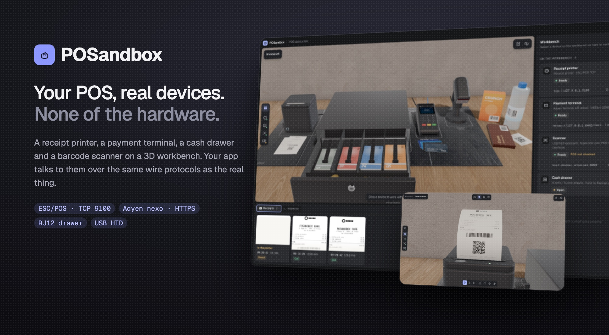
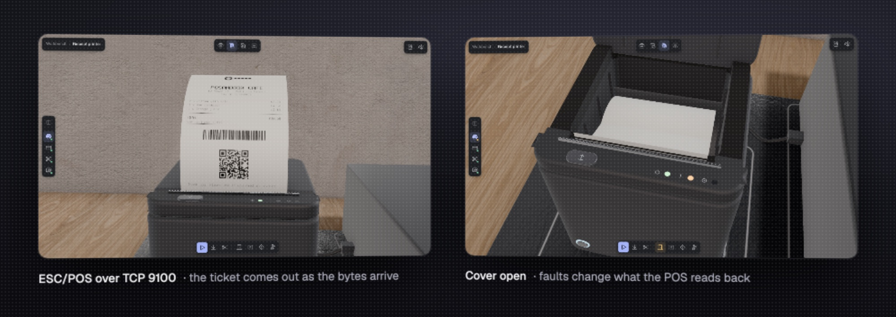
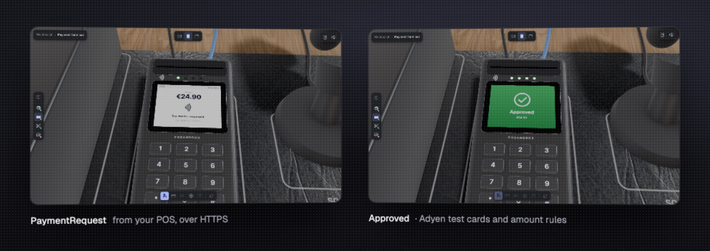
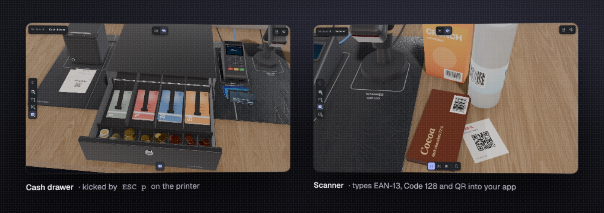
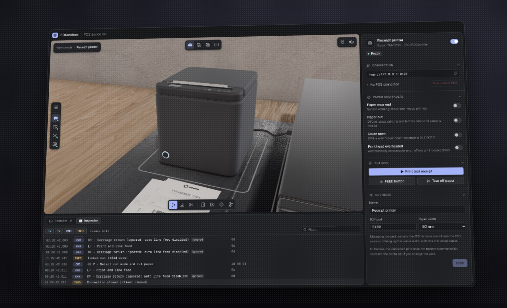

<div align="center">



**Your POS, real devices. None of the hardware.**

Docker or Node 24 · ESC/POS · Adyen Terminal API · [run it](#run-it)

</div>

## Why

Testing a point of sale means a receipt printer, a payment terminal, a cash drawer and a scanner on your desk, and you still can't make the paper run out on demand or the bank drop a response.

POSandbox puts those devices on a 3D workbench in your browser. Your app connects to them exactly as it connects to the real ones, over the same wire protocols, with no SDK, no mock and no code change. You watch what each device does and break it whenever you want.

## What's on the bench



- **Receipt printer.** An Epson TM-T20III on `tcp://127.0.0.1:9100`. It parses ESC/POS (text, styles, code pages with € and accents, images, barcodes, QR), answers status queries (`DLE EOT`, `GS r`, ASB, `GS I`) and prints the ticket out of the slot, cuts it and drops it on the counter. Paper out, paper low, cover open, head overheated and disconnects all change what your POS reads back, not just what you see.



- **Payment terminal.** Adyen Terminal API, local integration, on `https://127.0.0.1:8443/nexo` with a terminal certificate and shared-key encryption. Payments, refunds, reversals, abort, transaction status and diagnosis, with Adyen's test cards and amount rules. From the panel you are the shopper (tap, insert, swipe, type the PIN) or the bank (force a decline, lose the response).



- **Cash drawer.** Wired over RJ12 to the printer: opened by `ESC p` / `DLE DC4`, its state read on pin 3.
- **Barcode scanner.** A USB HID keyboard scanner that types into your Electron app through DevTools, with real key events (`isTrusted: true`). Click a product on the bench and it scans.



- **Inspector.** Every byte in and out, each command decoded with its support status, plus the receipt archive with a 2D viewer and PNG export.

## Run it

```sh
docker compose up --build
```

Open <http://localhost:8100> and point your POS at the printer (`127.0.0.1:9100`) and the terminal (`https://127.0.0.1:8443/nexo`, POIID `V400m-324688179`). No POS yet? Send it a ticket:

```sh
nc 127.0.0.1 9100 < fixtures/sample-ticket.bin
```

Without Docker: `pnpm install && pnpm build && pnpm start` (Node 24).

There is also a CLI that acts as a POS and drives the lab:

```sh
pnpm cli printer text "Café 3,20 €" --cut
pnpm cli terminal pay 12,50
pnpm cli lab fault paperOut on
```

With Docker the CLI is already in the image: `docker compose exec posandbox posandbox printer status`.

## Connect your POS

- **Printer.** A network printer at `127.0.0.1:9100`. Nothing else to set.
- **Payment terminal.** `https://<host>:8443/nexo` and the POIID shown in its panel. Download the CA from the panel (or `GET /api/terminals/counter/ca.pem`) and trust it where your Adyen library expects the root: `certificatePath` in Node, the truststore in Java, the system root store in .NET. If your POS uses a shared key, enter the same identifier, passphrase and version in the panel.
- **Scanner.** Start your Electron app in development with `--remote-debugging-port=9222`, focus the product field and click a product on the bench. Never ship that flag to production.

Ports are published on loopback only. Change them with `POSANDBOX_HTTP_PORT`, `POSANDBOX_PRINTER_PORT` and `POSANDBOX_TERMINAL_PORT`; configuration and receipts live in the `posandbox-data` volume.

## Develop

```sh
pnpm dev          # engine with --watch + Vite on http://localhost:5173
pnpm test         # unit and integration (node:test)
pnpm typecheck
pnpm e2e          # Docker: the lab + Playwright as a POS and as a panel user
```

## Scope

POSandbox emulates each device as your POS sees it on the wire. It is not the bank side of payments (EMV, issuer keys) and a good TCP ESC/POS emulation does not certify other models or connections. Test on real hardware before production.

## License

[GPL-3.0](LICENSE) © AbianS
